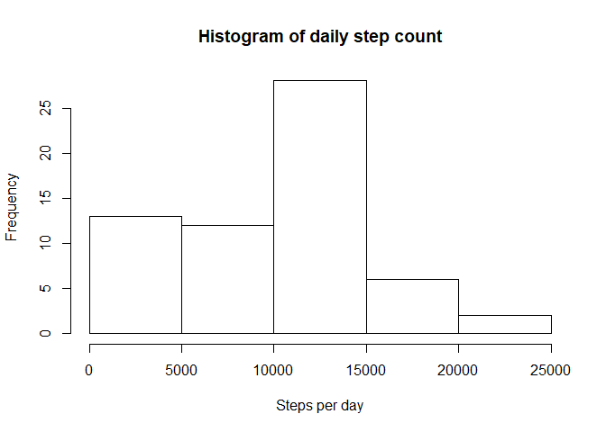
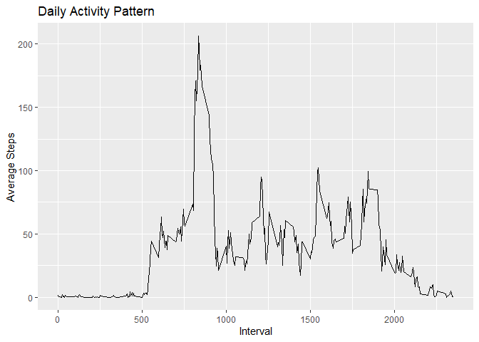
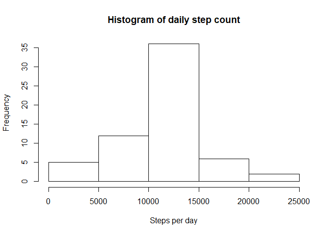
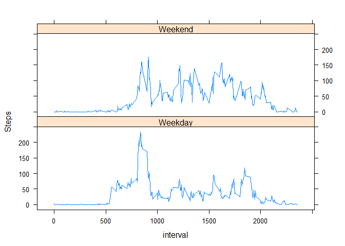

## Loading and preprocessing the data
First, we load some libraries and the needed the data using `read.csv` and then we make the following adjustments:
1. Convert `date` column to date format
2. Convert the interval to time


```r
#first, load in libraries
library(ggplot2)
library(tibble)
library(lubridate)
library(stringr)
library(dplyr)
library(lattice)

#load data
activityData <- read.csv(file="activity.csv",header=TRUE)

#convert date column to date
activityData$date <- as.Date(as.character(activityData$date),format='%Y-%m-%d')
activityData$interval <- as.factor(activityData$interval)

head(activityData)
```

```
##   steps       date interval
## 1    NA 2012-10-01        0
## 2    NA 2012-10-01        5
## 3    NA 2012-10-01       10
## 4    NA 2012-10-01       15
## 5    NA 2012-10-01       20
## 6    NA 2012-10-01       25
```

Now that the data is loaded in and processed, we can proceed to the graphs.


## What is mean total number of steps taken per day?

First, we get the total number of steps and the total number of days.

```r
totalSteps <- sum(activityData$steps, na.rm=TRUE)
totalDays <- length(unique(activityData$date))
```
There were 570608 steps taken over 61 days.

Next, we find the mean:


```r
averageSteps <- as.integer(totalSteps/totalDays)
```
The mean number of steps taken per day is 9354 steps.

Let's plot the number of steps per day as a histogram.

```r
daySteps <- aggregate(activityData$steps, by=list(activityData$date),FUN=sum, na.rm=TRUE)

hist(daySteps$x,xlab="Steps per day",main="Histogram of daily step count")
```

<!-- -->

## What is the average daily activity pattern?

First, we calculate the average number of steps per interval

```r
stepList <- tapply(activityData$steps, activityData$interval, mean, na.rm=TRUE)
```
This returns a list.

Next, we convert the list into a dataframe and ensure the interval is stored as a column rather than the row names.

```r
stepDf <- as.data.frame(stepList)
stepDf <- rownames_to_column(stepDf, var="interval")
```

Now that we have our data frame, we can turn this into a graph.


```r
stepGraph <- ggplot(data=stepDf, aes(x=as.integer(interval),y=stepList))

stepGraph <- stepGraph +
             geom_line() +
             labs(x="Interval",
                  y="Average Steps",
                  title="Daily Activity Pattern")
stepGraph
```

<!-- -->

There is clearly a max average number of steps across all intervals.

```r
maxIndex <- unname(which.max(stepList))
maxTime <- names(stepList[maxIndex])
```
The max average occurs at 835.


## Imputing missing values

To impute the missing values, it will be helpful to first know how many missing values there are.

```r
numMissingVals <- sum(is.na(activityData$steps))
```

There are 2304 missing values. 

To impute these missing values, we'll replace them with the interval average.

```r
#Create our data set where we'll impute data
imputedData <- activityData

#loop over original data set and impute values for NAs
for(i in 1:length(activityData$steps)){
    if(is.na(activityData$steps[i])){
        intervalVal <- as.character(activityData$interval)[i]
        imputedData$steps[i] <- unname(stepList[intervalVal])
    }
}
```

Now that we've imputed data, lets create a histogram of the total number of steps taken each day.

```r
daySteps <- aggregate(imputedData$steps, by = list(imputedData$date), FUN = sum)

hist(daySteps$x,xlab="Steps per day",main="Histogram of daily step count")
```

<!-- -->

Let's also grab an updated mean and median for total steps per day


```r
mnSteps <- as.integer(mean(daySteps$x))
mdnSteps <- as.integer(median(daySteps$x))
```

The mean number of steps per day is 10766 and the median number of steps per day is 10766. These numbers are clearly higher than what we initially found. This is because we are added additional steps each day with our imputed values.

## Are there differences in activity patterns between weekdays and weekends?

First, lets add a new variable to our dataset that returns whether or not the day is a weekday or not.


```r
activityData <- mutate(activityData, Is.Weekend = ifelse(weekdays(activityData$date) 
                                                            %in% c("Saturday","Sunday"),1,0))
activityData$Is.Weekend <- factor(activityData$Is.Weekend,
                                  levels=c(0,1),
                                  labels=c("Weekday","Weekend"))
```

Next, lets break this out into two plots: one for average steps by interval on weekdays and one for average steps by interval on weekends. We'll also convert the interval variable to an integer to make graphing easier.


```r
activityAvg <- aggregate(activityData$steps, by=list(activityData$interval, activityData$Is.Weekend), FUN=mean, na.rm=TRUE)

activityAvg$Group.1 <- as.integer(levels(activityAvg$Group.1))

xyplot(x ~ Group.1 | Group.2, data=activityAvg, 
       layout=c(1,2),
       type="l",
       ylab="Steps",
       xlab="interval"       ,
       scales=list(y=list(tick.number=5),
                   x=list(tick.number=5)))
```

<!-- -->
